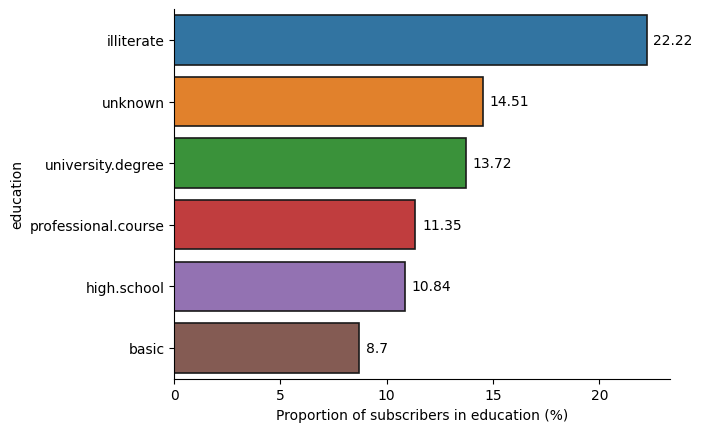
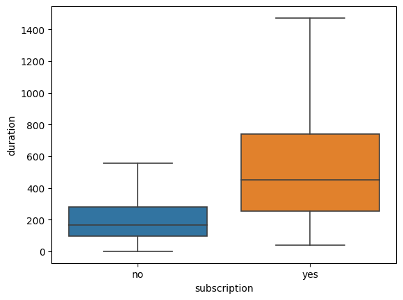
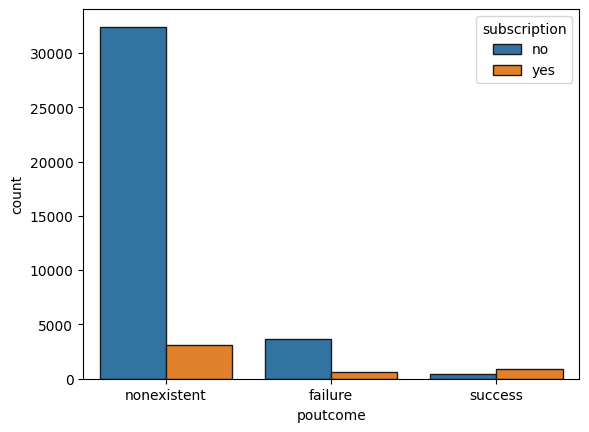
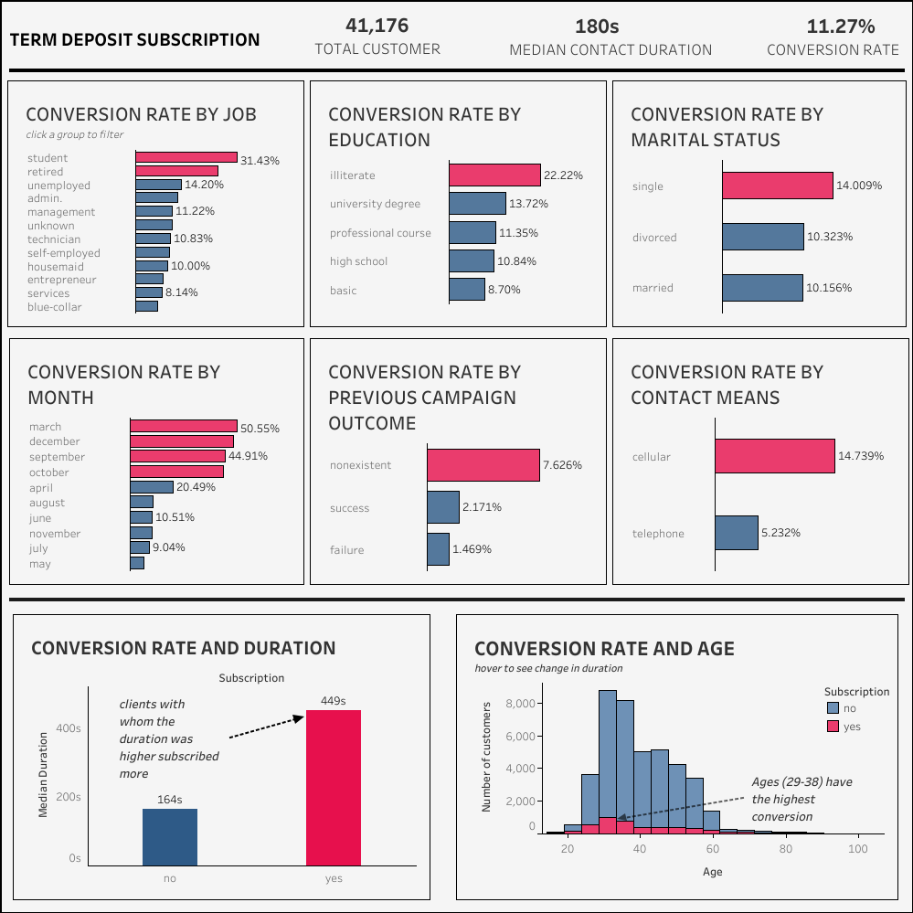

##  Description
 This project focuses on predicting whether a client will subscribe to a term deposit or not. Using the Bank Marketing Dataset obtained from the UCI Machine Learning Repository, we employed classification models, including Logistic Regression, Random Forest, and LightGBM, to address class imbalance and generate accurate predictions. Insights from exploratory data analysis highlighted factors influencing subscription rates, and the evaluation metric of recall prioritized capturing potential subscribers. Hyperparameter tuning further improved model performance.

## Key Insights:
- Students had the highest subscription rate, despite being a smaller group compared to others 

- Single individuals exhibited a higher proportion of subscribers.
- Illiterate individuals subscribed more than other groups, while clients with basic education had the lowest subscription rate.

- Certain months, such as March, December, September, and October, had higher subscription rates, with Thursday being the day of the week with the highest subscription.

- Clients who subscribed had longer median contact durations compared to non-subscribers.

- Clients with no previous campaign history had a higher subscription rate.

## Models Used:
- Logistic Regression
- Random Forest Classifier
- LGBM Classifier

## Evaluation Results:
After addressing class imbalance using class reweighing and random undersampling techniques, the models showed improved recall values for the positive class. After hyperparameter tuning using the Optuna library, the final model(LightGBM model) achieved a recall of approximately 73% on a separate test set, demonstrating its effectiveness in identifying potential subscribers.

## Tableau Dashboard:
I created a comprehensive [Tableau dashboard](https://public.tableau.com/app/profile/vaadewoyin/viz/Termdepositsubscription/Dashboard1) to visualize key insights. The dashboard provides a user-friendly interface for exploring the data and gaining a deeper understanding of the project's findings.

## GitHub Repository
For a detailed exploration of the analysis please visit my [GitHub repository](https://github.com/vaadewoyin/Bank-term-deposit-subscription-prediction/tree/main). The repository contains the Jupyter Notebook,codes, and associated files related to this project.

## Conclusion:
By predicting term deposit subscriptions, the developed model can help banks optimize their marketing strategies and enhance customer targeting. Feel free to explore the project details and Tableau dashboard to gain insights into customer behavior and the predictive power of the models.