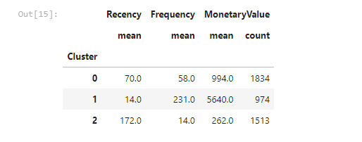
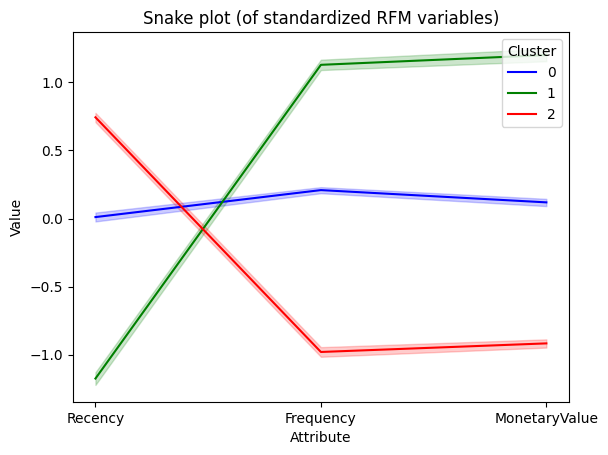

---
Title: "Driving Business Growth: Unlocking Customer Insights with RFM Analysis and K-means Clustering"
Summary: utilized RFM analysis and K-means clustering to segment customers based on their purchasing patterns, enabling targeted marketing strategies and personalized campaigns for business growth.
tags: ["RFM analysis", "Kmeans clustering", "customer segmentation", "snake plot"]
----
## Description 
This project focuses on customer segmentation using RFM (Recency, Frequency, Monetary) analysis and the K-means clustering algorithm. By analyzing customer transaction data from the Online Retail dataset, we aim to gain insights into customer behavior, identify valuable customer segments, and develop targeted marketing strategies.

## Key Features
- RFM Analysis: Utilized the RFM framework to measure customer recency, frequency, and monetary value.
- K-means Clustering: Applied the K-means algorithm to partition customers into distinct segments based on their purchasing patterns.
- Optimal Cluster Selection: Utilized the elbow curve and silhouette score to determine the optimal number of clusters.
- Segmentation Recommendations: Provided actionable insights and recommendations for each customer segment.

## Result
 

The customer segmentation resulted in three distinct segments:

1. Cluster 0: Recent but Low-Value Customers
   - Approximately 24% of total revenue.
   - Lower frequency and monetary value.
   - Recommendations: Implement targeted promotions, personalized offers, and loyalty programs to increase engagement and loyalty.

2. Cluster 1: High-Value and Loyal Customers
   - Most valuable segment.
   - High frequency of purchases and significant monetary value.
   - Recommendations: Provide personalized recommendations, exclusive deals, and premium services to enhance their experience and maintain their loyalty.

3. Cluster 2: Churn-Prone Customers
   - Approximately 5% of total revenue.
   - Longer recency period, lower frequency, and monetary value.
   - Recommendations: Adopt special strategies to prevent churn, such as win-back campaigns, re-engagement strategies, or special discounts.

## snake plot

## GitHub Repository
For a detailed exploration of the analysis please visit my [GitHub repository](https://github.com/vaadewoyin/Customer-Segmentation-using-RFM-Analysis-and-K-means-Algorithm). The repository contains the Jupyter Notebook,codes, and associated files related to this project.

## Conclusion
By identifying distinct customer segments and understanding their preferences and behaviors, businesses can optimize their marketing efforts and enhance customer satisfaction. Feel free to explore the project and its findings to gain insights into customer segmentation and personalized marketing strategies.

