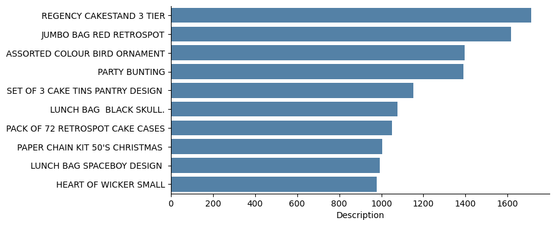
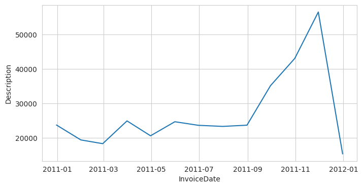
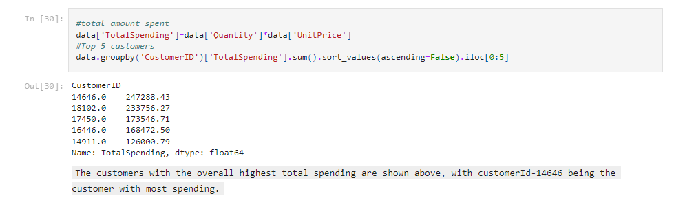
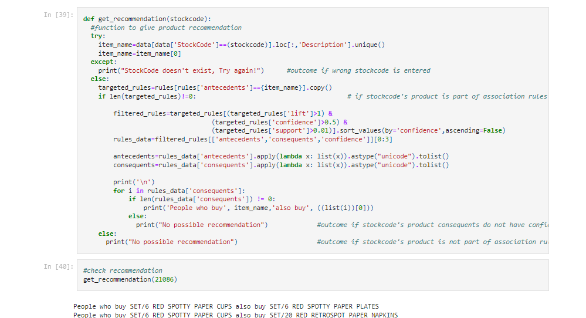

### Introduction
Market Basket Analysis is a powerful data mining technique that uncovers associations and patterns within customer transactions, enabling retailers to optimize their business strategies. By analyzing customer purchase patterns, this analysis helps identify which items are frequently bought together or sequentially, providing insights for product placement, cross-selling, and targeted marketing. In this project, we applied Market Basket Analysis to uncover hidden patterns and associations within a dataset of customer transactions, allowing us to generate meaningful and actionable insights.

### Dataset
The Online Retail Data Set contains a wealth of information about customer transactions, including invoice details, purchased items, quantities, and customer IDs. By exploring this dataset and analyzing purchasing patterns, we can identify relationships between different products and gain valuable insights. We performed necessary data cleaning and transformations to prepare the data for Market Basket Analysis using the Apriori algorithm.

### Insights from Exploratory Data Analysis
- The "Regency Cakestand 3 Tier" emerged as the top-selling item based on purchase frequency.

- The day with the highest number of items purchased was 2011-11-14, and November 2011 recorded the highest overall purchase volume.

- The majority of purchases were made by customers in the United Kingdom, followed by Germany and other countries.
- Saudi Arabia, Bahrain, Czech Republic, Brazil, and Lithuania had the lowest purchase rates, indicating fewer customers in these regions.
- The most expensive item in the dataset was the "VINTAGE RED KITCHEN CABINET" with a unit price of 295.
- Customer ID 14646 had the highest spending among all customers.

### Apriori Algorithm and Association Rules
The Apriori algorithm, a popular association rule mining technique, efficiently discovers frequent itemsets to generate meaningful association rules. Association rules capture relationships between items based on their co-occurrence in transactions and include measures like support, confidence, and lift.

In this analysis, we generated a total of 646 association rules. To focus on meaningful associations, we applied a minimum lift threshold of 1.01 during the pruning stage of the Apriori algorithm. Lift values greater than 1 indicate significant positive associations, aligning with our objective of uncovering meaningful relationships among items.

The first five rows of the association rule table is given below:

| antecedents                          | consequents                           | antecedent support | consequent support | support   | confidence | lift     | leverage | conviction |
|--------------------------------------|---------------------------------------|--------------------|--------------------|-----------|------------|----------|----------|------------|
| (PACK OF 72 RETROSPOT CAKE CASES)    | (60 CAKE CASES DOLLY GIRL DESIGN)      | 0.056390           | 0.019399           | 0.010357  | 0.183673   | 9.468004 | 0.009263 | 1.201236   |
| (60 CAKE CASES DOLLY GIRL DESIGN)    | (PACK OF 72 RETROSPOT CAKE CASES)      | 0.019399           | 0.056390           | 0.010357  | 0.533898   | 9.468004 | 0.009263 | 2.024473   |
| (72 SWEETHEART FAIRY CAKE CASES)     | (60 TEATIME FAIRY CAKE CASES)          | 0.027455           | 0.036004           | 0.012111  | 0.441118   | 12.251928| 0.011122 | 1.724864   |
| (60 TEATIME FAIRY CAKE CASES)        | (72 SWEETHEART FAIRY CAKE CASES)       | 0.036004           | 0.027455           | 0.012111  | 0.336377   | 12.251928| 0.011122 | 1.465509   |
| (60 TEATIME FAIRY CAKE CASES)        | (PACK OF 60 DINOSAUR CAKE CASES)       | 0.036004           | 0.028989           | 0.012221  | 0.339422   | 11.708442| 0.011177 | 1.469940   |

### Results
The generated association rules provide valuable insights for various business applications. These rules can be utilized to identify patterns, optimize store layouts, and select items for cross-selling purposes. For instance, we can gain valuable insights into products frequently purchased together, enhancing marketing strategies, optimizing store layouts, and implementing cross-selling initiatives.

Example of a discovered association rule:  
"If a customer purchases POPPY'S PLAYHOUSE LIVINGROOM , they are highly likely to also purchase POPPY'S PLAYHOUSE KITCHEN."

We also created a simple market basket analysis-based recommendation system using item stock codes, enabling personalized recommendations for customers.

## GitHub Repository
For a detailed exploration of the analysis please visit my [GitHub repository](https://github.com/vaadewoyin/Association-Rule-Mining-for-Retail-Analytics-Market-Basket-Analysis-). The repository contains the Jupyter Notebook,codes, and associated files related to this project.
