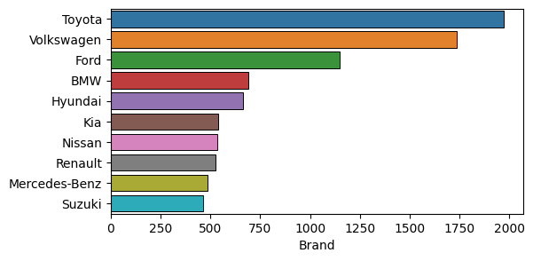
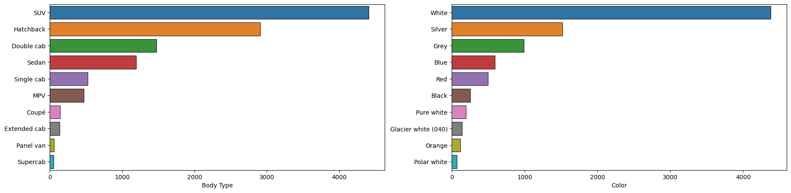
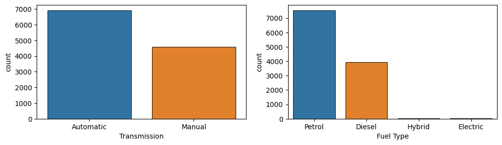
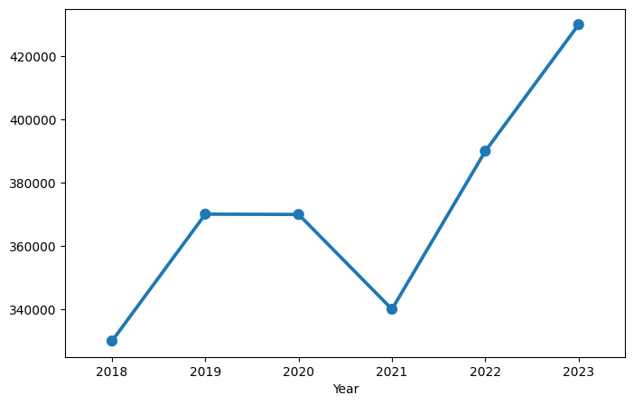
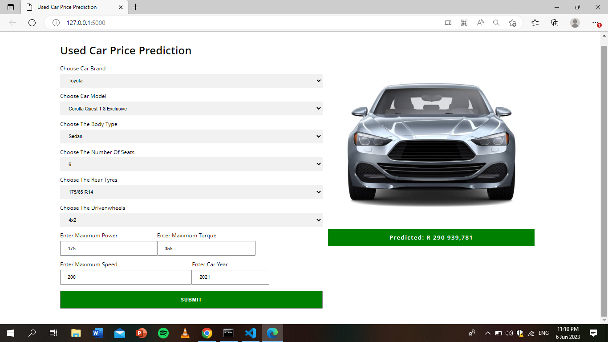

## Description
The Used Car Price Prediction project uses machine learning to accurately estimate the prices of used cars. By analyzing car features like brand, model, year, and performance indicators, the project empowers buyers and sellers with reliable price estimates. The dataset, obtained by scraping a popular car marketplace and consisting of around 19,000 cars, forms the foundation for exploring the relationships between different car attributes and their impact on pricing dynamics

## Work flow

graph LR
A[Data Collection through web scraping] --> B[Data Cleaning]
B --> C[Exploratory Data Analysis and Modeling]
C --> D[Flask Web App]


## Key Insights
- Toyota is the most frequent used car brand in the dataset. this is true since the most popular car brand in South Africa is Toyota. After Toyota is Volkswagen and the rest.

- SUV dominates as the most popular used car brand sold on Autotrader South Africa. With regards to color, the top 3 colors of used cars on the website are white,silver and grey.

- There are more used cars with automatic transmission compared to the manual. with respect to fuel type, cars with petrol fuel type are most frequent, a very small number of cars have hybrid or electric fuel type

- The median prices of used cars manufactured in 2018 were the lowest compared to other years

- Cars with all-wheel drive have higher median price compared to other driven wheels type.
- Cars with v12 cylinder layout have significant higher median price compared to the rest. This is expected as cars with V12 cylinders are typically high-end, luxury vehicles that are known for their exceptional performance and high price tags

## Models Used
- SVR
- KNeighborsRegressor
- RandomForestRegressor
- XGBRegressor
- LGBMRegressor

## Results
The best-performing model, XGBRegressor, achieves  a mean absolute error (MAE) of 29,908.83 and an R-squared score of 0.94 on a separate test set.

| Metric          | Value    |
|-----------------|----------|
| MAE on test set | 29908.83 |
| R2 score        | 0.94     |

## Flask Web App

To facilitate seamless price predictions, a user-friendly Flask web application is developed. Users can input relevant car details, such as brand, model, year, and performance indicators, and obtain instant price estimates based on the trained machine learning model.

## Tableau Dashboard
An [interactive Tableau](https://public.tableau.com/app/profile/vaadewoyin/viz/UsedCarPriceDashboard/Dashboard1) dashboard was made. (*visit the link to interact with the dashboard*)

## GitHub Repository
For a detailed exploration of the analysis please visit my [GitHub repository](https://github.com/vaadewoyin/used-car-price-prediction). The repository contains the Jupyter Notebook,codes, and associated files related to this project.

## Conclusion

The **Used Car Price Prediction** project demonstrates the power of machine learning in accurately predicting the prices of used cars. By leveraging data analysis and regression models, this project empowers buyers and sellers with reliable price estimates, facilitating informed decision-making in the automotive market.